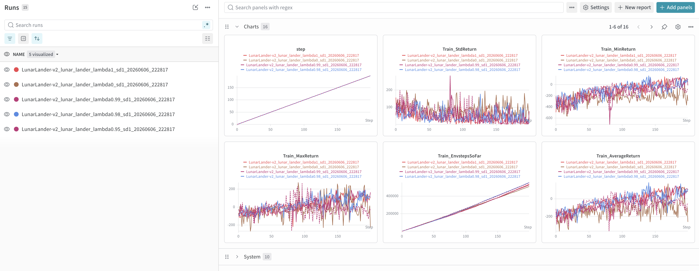

# Write Ups

## Vanilla Policy Gradient

See run results at https://wandb.ai/yang7-cooper-google/cs285_hw2/table, under tag `hw2_part3`.

> Which value estimator has better performance without advantage normalization: the trajectorycentric one, or the one using reward-to-go?

RTG generally outperforms vanilla version.

> Between the two value estimators, why do you think one is generally preferred over the other?

Causality implies past rewards from past actions do not matter for future reward estimates, thus RTG helps to prevent incorrectly awarding or penalizing a current action, when we try to estimate its future reward weight `Q(s, a)`.

> Did advantage normalization help?

Yes. It reduced variance of min/max/avg returns.

> Did the batch size make an impact?

Yes. Average return converged quicker with larger batch size, though towards the end around step 95+, large batch rtg + advantage normalization regressed in average return, while smaller batch size didn't regress.

## Generalized Advantage Estimation

See run results at https://wandb.ai/yang7-cooper-google/cs285_hw2/table, under tag `hw2_part5`.

> Consider the parameter λ. What does λ = 0 correspond to? What about λ = 1? Relate this to the task performance in LunarLander-v2 in one or two sentences.

λ is positively correlated with variance (and thus negatively correlated with bias):
* λ = 0 means low variance high bias, effectively running TD(0).
* λ = 1 means high variance low bias, effectively running Monte Carlo.

In this run, λ = 1 appers to perform the best, suggesting low-bias MC estimator is more helpful than low-variance TD estimators for LunarLandar. However, this is just one seed so may be inconclusive.
